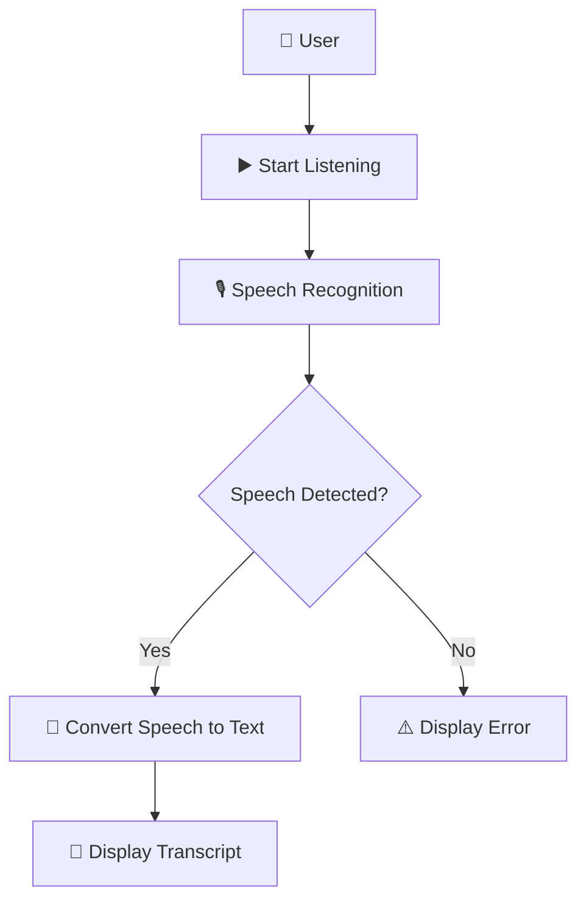

🎙️ VOICE TO TEXT GENERATOR

Turn spoken words into written text directly in your browser.

A lightweight and interactive Speech-to-Text application built with HTML, CSS and JavaScript. The project uses the browser’s built-in Speech Recognition capabilities to capture spoken input and display the recognized text instantly.

━━━━━━━━━━━━━━━━━━━━━━━━━━━━━━━━━━━━

✨ FEATURES

🎙️ Voice Recognition
Capture spoken words through the browser's speech recognition functionality.

📝 Real-Time Text Output
Display recognized speech directly on the screen.

▶️ One-Click Listening
Start speech recognition through a simple interactive button.

🌐 Browser-Based
Runs directly in a compatible web browser without requiring a backend.

⚡ Lightweight
Built with core web technologies and minimal dependencies.

⚠️ Error Feedback
Displays recognition errors when the browser encounters an issue.

━━━━━━━━━━━━━━━━━━━━━━━━━━━━━━━━━━━━

🛠️ TECHNOLOGY STACK

🌐 HTML5
🎨 CSS3
⚡ JavaScript
🎙️ Web Speech API
🧩 DOM Manipulation
🖥️ Browser Speech Recognition

━━━━━━━━━━━━━━━━━━━━━━━━━━━━━━━━━━━━

🏗️ APPLICATION FLOW



━━━━━━━━━━━━━━━━━━━━━━━━━━━━━━━━━━━━

🔄 HOW IT WORKS

① Start
The user activates the listening button.

② Listen
The browser's speech recognition functionality begins capturing speech.

③ Recognize
The spoken input is processed by the browser's speech recognition system.

④ Convert
Recognized speech is converted into text.

⑤ Display
The resulting transcript appears directly in the application interface.

⑥ Handle Errors
If recognition fails, the interface provides an error message.

━━━━━━━━━━━━━━━━━━━━━━━━━━━━━━━━━━━━

📂 PROJECT STRUCTURE

```text id="v2gq0p"
voice-to-text-generator/
│
├── .voice to text generator.html
└── README.md
```

━━━━━━━━━━━━━━━━━━━━━━━━━━━━━━━━━━━━

🧠 CONCEPTS DEMONSTRATED

🎙️ Speech Recognition
⚡ JavaScript Event Handling
🧩 DOM Selection & Manipulation
🔄 Event-Driven Programming
📝 Dynamic Text Rendering
⚠️ Error Handling
🌐 Browser APIs
🎨 CSS Styling
📱 Basic Responsive Web Structure

━━━━━━━━━━━━━━━━━━━━━━━━━━━━━━━━━━━━

💡 PROJECT HIGHLIGHTS

🎙️ Built a browser-based Speech-to-Text application using JavaScript.

🌐 Integrated the Web Speech API to capture and recognize spoken input.

📝 Dynamically updates the interface with the recognized transcript.

🖱️ Implemented interactive controls for starting speech recognition.

⚠️ Added recognition error handling to provide user feedback.

🧩 Created the application using lightweight frontend technologies without a backend.

━━━━━━━━━━━━━━━━━━━━━━━━━━━━━━━━━━━━

🚀 FUTURE ENHANCEMENTS

🌍 Multi-Language Recognition
⏯️ Pause & Resume Listening
📝 Editable Transcript
📋 Copy Transcript
💾 Download Text
🗑️ Clear Transcript
🎙️ Continuous Dictation
🎨 Enhanced User Interface

━━━━━━━━━━━━━━━━━━━━━━━━━━━━━━━━━━━━

🎙️ SPEAK → RECOGNIZE → CONVERT → READ


